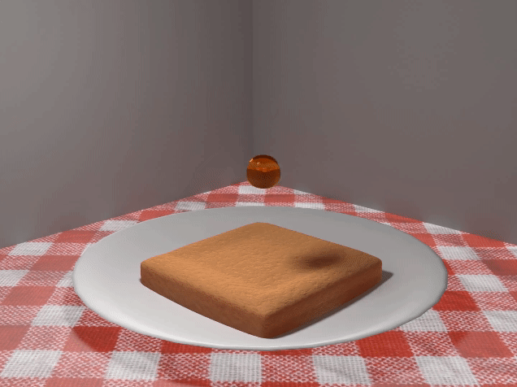
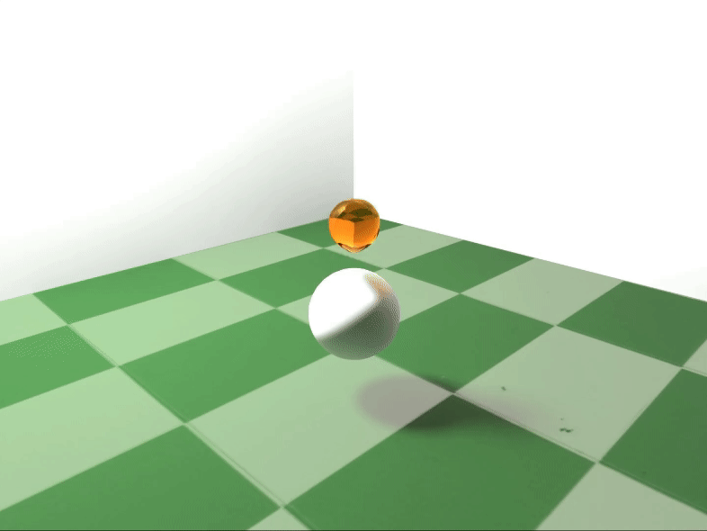

<h2><strong>Honey, I Upped the Viscosity! 🍯</strong></h2>
Team Members: Ashley Chiu, Emmanuel Duarte, Dana Feng, Raymond Tan | [Slides](https://docs.google.com/presentation/d/1piaKM1i2I8qUL0LpA0blxNTJihbHbPOOc3b5brOU8vE/edit?usp=sharing) | [Video](https://www.youtube.com/watch?v=Ucls9YOQVhE)

## Abstract
TODO: ash

## Technical Approach

### Set Up
Building off Project 4 `Clothsim`, we converted the `PointMass`es of a `Cloth` into `Particle`s, with attributes such as velocity, radius, mass, momentum, and viscosity. We then collided these `Particle`s with a `Sphere` and a `Plane`, creating different scenes.

### Particle Simulation Physics
We effectively implemented two different particle simulations Lagrangian based particle simulation (with and without volume preservation) and one based on Smoothed Particle Hydrodynamics. 

#### Lagrangian Particle Model
We modeled our simulation off of [Modeling and Rendering Viscous Liquids](https://citeseerx.ist.psu.edu/document?repid=rep1&type=pdf&doi=bdbe45284686a54f3284fdf98759f099e3a95e84). We created a similar cell structure that houses a vector of particles for better spatial lookup, and for each particle we hashed the particle to a cell, using the hash key provided: `541i + 79j + 31k mod table_size`; we did however, scale the `i`, `j`, and `k` by 10 so as to spread the particles more evenly in buckets, and set the table size to 100. In addition, we also integrated OpenMP parallelization over all possible `for` loops, which help tremendously so our simulations were no longer buffering at every frame. At a high level, the paper describes adding forces and gravity to each particle at each timestep $F(p) = \sum_{i} f(p_i) + g$, with adhesion forces, viscosity forces, and friction/interpenetration forces. For adhesion forces, the Lennard-Jones potential was used, following a sample piecewise graph given between particles of distance `d`. 

Instead of using adhesion forces between the honey and the sphere/bread as described in the paper, we use friction forces instead, and calculate a correction vector to ensure that there is adhesion to the bottom of the sphere only if the liquid particle is within a certain proximity to the sphere. We also apply the collision calculations between the particles and sphere so as to prevent the particles from sinking into the sphere. In terms of viscosity forces, we use the paper's momentum equations to calculate the momentum exchange. However, we also created and tuned a piecewise gaussian function so that it only returns a gaussian value if the distance between two particles is less than `0.4`, rather than the paper's specified `4-6`. Then, we explicitly convert the particle momentum to a force by dividing it by the change in time. We also add damping constants to all the forces, which was not mentioned in the paper, but we found that without these constants, the particles would explode and basically repel each other violently. The constants we chose were 0.1 and 0.01 for adhesion and viscosity respectively. Finally, we implemented interpenetration prevention, which was not at all described in detail in the paper, so we ended up just adding a correction vector to move two particles apart if they were overlapping one another. It was interesting as we had to calculate distance between two particles while taking into account their radii rather than just the difference between their center positions. 

While this initial implementation without volume preservation worked well, we wanted to see if we could get more of a mushroom and pooling effect by implementing volume preservation. Thus, we also implemented volume preservation, as detailed in the paper. First, we calculated the desired density of each particle by this equation: $$\rho_0 = \sum_{i=1}^{26} \omega(d_i) \\$$, where $$\omega$$ refers to a piecewise density smoothing kernel, following the paper's lower and upperbound of `2rsqrt(3) to 4r`. We then refine the density calculation by either scaling by `26/n` if the particle had less than 26 neighbors (n neighbors instead). The paper also mentions the derivative of the density, but the paper does not use the derivative in the calculations anywhere, so we did not either. We then calculated the correction vector to be applied to each particle's position: $$\Delta v = \frac{(c(\rho - \rho_0) \mathbf{p_n} - p)}{\|\mathbf{p_n} - p\|}$$, where we chose c to be 0.001, rather than 0.1-0.5 as described in the paper.

We also applied 0.1 as the damping factor when adding each of the correction vectors, as we found that volume preservation without damping resulted in particles being blown away from each other. We also only do one iteration of this correction, as we found that the computation was too intensive/slow for more than 1 iteration.

Overall, implementing the particle physics allowed us to understand the amount of tuning and scaling of different hyperparameters/values that go into a graphics simulation. It also made us appreciate papers that are more detailed in their technical implementation; while the paper we followed was pretty detailed, some sections such as interpenetration was not explained as in depth, and they also did not specify how many particles they used or what constants they chose.

#### Smoothed Particle Hydrodynamics
Smoothed Particle Hydrodynamics (SPH) is a method of incorporating neighboring particles into calculations for a given particle. Our model was largely based on [An Implicit Viscosity Formulation for SPH Fluids](https://cg.informatik.uni-freiburg.de/publications/2015_SIGGRAPH_viscousSPH.pdf). First, we determined a smoothing radius for each particle – this would determine at what range would other particles have an effect on the current one. After tweaking with this parameter, we found optimal results when `PARTICLE_SMOOTHING_RADIUS` was set to `0.1`. SPH requires identifying neighboring particles to calculate interactions. To make the process of looking up neighbor particles more efficient, we used spatial cell hashing, which was largely inspired by the tutorial video Coding Adventure: Simulating Fluids. Spatial Cell Hashing works by assigning each particle its own “particle index”, which is an unique identifier for a particle within our simulation. We associate with each particle index a `cellKey`, which is a hashed value based on the position of the current particle. The `cellKey` determines which cell the current particle belongs to. This pair is then stored into a vector we designate as `spatialLookup`. Afterwards, we sort `spatialLookup` by the `cellKey`, which makes it so that all particles within the same cell are next to each other in the the list. We wrote a function called `ForeachPointWithinRadius`, which was a generic function that returns all the neighboring particles within radius `PARTICLE_SMOOTHING_RADIUS` as an `std::unordered_set` at a given snapshot of the simulation. The code loops through every one of the 27 offsets we can go through in 3D space, getting the cell associated with the position of the particle + the current offset. These offsets can lead us to loop through the same cells, which is why a `std::unordered_set` data structure is used to prevent duplicate neighboring particles from being returned.

SPH was used in our code for various purposes, ranging from calculating individual densities of particles at each timestep of our simulation, to calculating how neighboring particles would affect pressure forces applied to a given particle. Here, we used a smoothing kernel function to determine the influence a neighboring particle had, which varied in sync with the euclidean distance of the neighboring particle to the given particle. The smoothing kernel function used a scale of $\frac{315}{64 \cdot \pi \cdot \mid r \mid^9}$. This value is derived from the normalization condition of the cubic spline kernel function in 3D, as outlined in [An Implicit Viscosity Formulation for SPH Fluids](https://cg.informatik.uni-freiburg.de/publications/2015_SIGGRAPH_viscousSPH.pdf). 

Overall, we found SPH to be a very intuitive approach to honey simulation, and a quite fun one to implement. A challenge we faced was finding the optimal `PARTICLE_SMOOTHING_RADIUS` – we didn’t want to choose a value that was too high, as that would encompass too many neighboring particles. Choosing a value that was too low would result in not enough neighboring particles being considered, so we had to play around with this value and see how it affected the simulation. 

#### Particle Simulation Videos

  

    

      <iframe 
        src="https://www.youtube.com/embed/XzGDkuJSUBg" 
        style="position: absolute; top: 0; left: 0; width: 100%; height: 100%;" 
        frameborder="0" 
        allow="accelerometer; autoplay; clipboard-write; encrypted-media; gyroscope; picture-in-picture" 
        allowfullscreen>
      </iframe>
    

    <figcaption style="text-align: center;">Lagrangian Particle Simulation (w/ volume preservation)</figcaption>
  

  

    

      <iframe 
        src="https://www.youtube.com/embed/J5LI25tfK2s" 
        style="position: absolute; top: 0; left: 0; width: 100%; height: 100%;" 
        frameborder="0" 
        allow="accelerometer; autoplay; clipboard-write; encrypted-media; gyroscope; picture-in-picture" 
        allowfullscreen>
      </iframe>
    

    <figcaption style="text-align: center;">Lagrangian Particle Simulation (w/o volume preservation)</figcaption>
  

  

    

      <iframe 
        src="https://www.youtube.com/embed/fJepjb6OCTQ" 
        style="position: absolute; top: 0; left: 0; width: 100%; height: 100%;" 
        frameborder="0" 
        allow="accelerometer; autoplay; clipboard-write; encrypted-media; gyroscope; picture-in-picture" 
        allowfullscreen>
      </iframe>
    

    <figcaption style="text-align: center;">Smoothed Particle Hydrodynamics Simulation</figcaption>
  

We included all three (particularly, two versions of the Lagrangian simulation) because we noticed benefits and issues with each of the three in our implementation. Namely, although the Lagrangian version without volume preservation looked the weakest, it ran comparably faster than the other two (and as such, also produced fairly good outputs). In comparison, the Lagrangian version with volume preservation had a bit of jittering with particles under the sphere. Finally, our SPH implementation required more than 3,000 particles to simulate smoothly, which proved to be too difficult in our surface reconstruction attempts.

### Surface Reconstruction

We explored 3 separate meshing/rendering techniques, and found that metaballs in Blender was the most suitable for our simulation. We tried Marching Cubes on all three of our particle simulations, tried OpenVDB on our SPH simulation, and applied Metaballs to our two Lagrangian particle simulations, as our SPH simulation required 5,000 particles, which was too much for Metaballs.

#### Marching Cubes

Finding Marching Cubes to be a common solution, we initially tried building off [this GitHub repository](https://github.com/nihaljn/marching-cubes), debugging and changing codes to parse our particle position files and tuning isovalues. However, our resulting images always ended up with individual cubes per particle or inverted meshes that did not resemble fluids. We tried increasing the number of particles and interpolating to produce more densely populated particles, both to no avail.

  <table style="width:100%">
<colgroup>
      <col width="30%" />
      <col width="30%" />
      <col width="30%" />
  </colgroup>
    <tr>
        <td align="center">
        
        <figcaption>Lagrangian Simulation (without volume preservation), 8000 vs 1000 particles</figcaption>
        </td>
        <td align="center">
        
        <figcaption>Lagrangian Simulation (with volume preservation), Averaging/Interpolation</figcaption>
        </td>
        <td align="center">
        
        <figcaption>SPH Particle Simulation with Poly6 kernel isovalues (Ball of honey) </figcaption>
        </td>
    </tr>
    </table>

#### OpenVDB
When attempting to generate meshes for surface reconstruction from particles in OpenVDB, we struggled a great deal with installation problems as all four had hours of compilation errors and package issues in installation. We are really thankful to the two TAs that were able to help us get this package installed and working on our machines. Beyond this, there was limited documentation online regarding using OpenVDB as a method of converting particle positions directly to a mesh. We used a lot of trial and error to see which methods of OpenVDB could be used in getting us to our goal. 

To get the meshes to output using OpenVDB, we first had to convert our particles to a custom `MyParticle` struct, which we defined to store the position, velocity, and radius of the particle. We then constructed a grid using the OpenVDB `createLevelSet`. Next, we `raster`ed to set the grain size, and initialize the particles into spheres for our grid. Finally, we used `VolumeToMesh` to get a `.obj` mesh file from our grid, importing these files into Blender, and stitching using [Stop-Motion-Obj](https://github.com/neverhood311/Stop-motion-OBJ). 

We found the animation to be a lot more smooth with this method, as all the particles remained connected during the animation, much like real honey would while being dropped onto a sphere. Generating the obj files was relatively quick as well, which allowed us to perform parameter-tuning a lot easier. 

#### Metaballs
Our last attempt at "surface reconstruction" was to script the particle positions at each 16-32 timesteps to each represent a Metaball, using the `bpy` Blender Python package. The most we could render was approximately 3k particles, hence why we were unable to render our SPH simulation using Metaballs.

Tuning the size of Metaballs so it didn't look like individual orbs of honey (or honey boba), we set the Metaball size to 0.04 to 0.07 for simulations with 2,000-3,000 particles, and to 0.08 to 0.1 for simulations with 1,000 particles.

Overall, we learned the importance of exploring and adopting various meshing techniques, and the importance of using suitable and well-documented methods.

### Blender-ing Rendering
Finally, after porting over the Metaballs into Blender, we used the Cycles Engine (for physically-based path tracing) and read through a multitude of documentation to set up the final rendering scenes, including defining nodes for honey shading, environment shadows and reflections, caustics, and using  [Procedural Bisucit Material (Blender Tutorial)](https://www.youtube.com/watch?v=52dC0yBS35I) as a guide to modeling a slice of bread.

### Problems Encountered
- **Volume preservation**: Early on, we struggled with density preservation as honey dripped and hit a plane. It would settle on the plane, but overlap, without ever truly pooling out as honey normally would in the real world. Honey needed to stay viscous and remain stuck to the sphere while it dripped off at the bottom, which was a difficult task. We implemented two separate viscosity models in order to attempt to fix this, using both a Lagrangian Particle Model and Smoothed Particle Hydrodynamics. By testing two different frameworks, we better understood the problem as a whole, even though ultimately, the tuning of our original milestone simulation with volume preservation produced better results, and as such, most of our polished renders occurred under this physics engine.
- **Surface reconstruction**: Originally, we considered doing surface reconstruction via Marching Cubes and OpenVDB, however, after gaining little progress (sparse or inverted meshes), we salvaged via Metaballs in Blender. This took up a lot of our time as well, as we had to make multiple pivots in our implementation.
- **Tuning parameters**: As a whole, tuning parameters was fairly difficult, from viscosity parameters and the Lennard-Jones potential to Metaball sizes and color realism of honey. This required a lot of trial and error on our end to determine what looked the most "realistic", which was difficult to standardize.

Through these two problems, we learned to divide and conquer work here so pairings would work on separate physics engines or surface reconstruction methods to gain an understanding of viability.

## Results
Honey, Let's Go Picnicking! In the video below, we show our rendered honey dripping and pooling on a slice of bread. This uses 2,000 particles using our Lagrangian Particle Model with volume preservation.

  <table style="width:100%">
    <tr>
        <td align="center">
        
        </td>
    </tr>
    </table>

We also rendered a scene to mimic our [reference image](/assets/proposal/honey_on_sphere.png). 

  <table style="width:100%">
<colgroup>
      <col width="50%" />
      <col width="50%" />
  </colgroup>
    <tr>
    <td align="center">
        
        <figcaption>Lagrangian Simulation (w/o volume preservation), 3,000 particles</figcaption>
        </td>
        <td align="center">
        
        <figcaption>Lagrangian Simulation (w/ volume preservation), 2,000 particles</figcaption>
        </td>
    </tr>
    </table>

## References
- [Modeling and Rendering Viscous Liquids](https://citeseerx.ist.psu.edu/document?repid=rep1&type=pdf&doi=bdbe45284686a54f3284fdf98759f099e3a95e84)
- [An Implicit Viscosity Formulation for SPH Fluids](https://cg.informatik.uni-freiburg.de/publications/2015_SIGGRAPH_viscousSPH.pdf)
- [Coding Adventures: Simulating Fluids](https://www.youtube.com/watch?v=rSKMYc1CQHE)
- [Poligonising a scalar field](https://paulbourke.net/geometry/polygonise/)
- [Marching Cubes](https://github.com/nihaljn/marching-cubes)
- [Stop-Motion-Obj](https://github.com/neverhood311/Stop-motion-OBJ)
- [Procedural Bisucit Material (Blender Tutorial)](https://www.youtube.com/watch?v=52dC0yBS35I)

## Contributions
Ashley Chiu
- Created the base particle model by refactoring `Clothsim`, as well as initial scene setups
- Incorporated OpenMP parallelization
- Implemented solid-liquid viscous interactions in the Lagrangian model
- Helped tune viscosity simulation and debug volume preservation for the Lagrangian model
- Built up Blender rendering pipeline via honey shading, shadows, environment reflections, and caustics
- Set up Blender final scenes, including creating the bread slice
- Scripted and rendered Metaball images and final videos
- Completed the milestone slides, video, and write up
- Contributed to the final slides, video, and write up

Emmanuel Duarte
- Worked on adhesion, pooling, and volume preservation for the Lagrangian model
- Worked around the structure of Homework 4's code structure and abstractions to implement SPH from the ground up
- Worked with OpenVDB to convert SPH point clouds to volumes, and then to meshes. Took those meshes, turned them into .obj files, and imported into blender for animation stitching. Rendered out frames for write up and presentation.
- Contributed to final slides and write up

Dana Feng
- Performed the initial research, determined applicable fluid simulation papers
- Built the initial Lagrangian model including the viscosity model, particle interpenetration, spatial cell hashing, and liquid-liquid interactions
- Led the volume preservation debugging for the Lagrangian model
- Led integration of marching cubes, tuning isovalues and interpolating extra positions for sparse meshes
- Scripted and rendered Metaball images and final videos
- Contributed to final write up

Raymond Tan
- Helped with researching ideas during project proposal stage
- Worked on SPH simulation
- Worked on incorporating OpenVDB into simulation to create meshes out of particles to render in Blender
- Contributed to final slides and write up

<i>navigate to checkpoints in our journey to render honey:</i> [final report](/index.md) -> [milestone](/milestone.md) -> [proposal](/proposal.md)